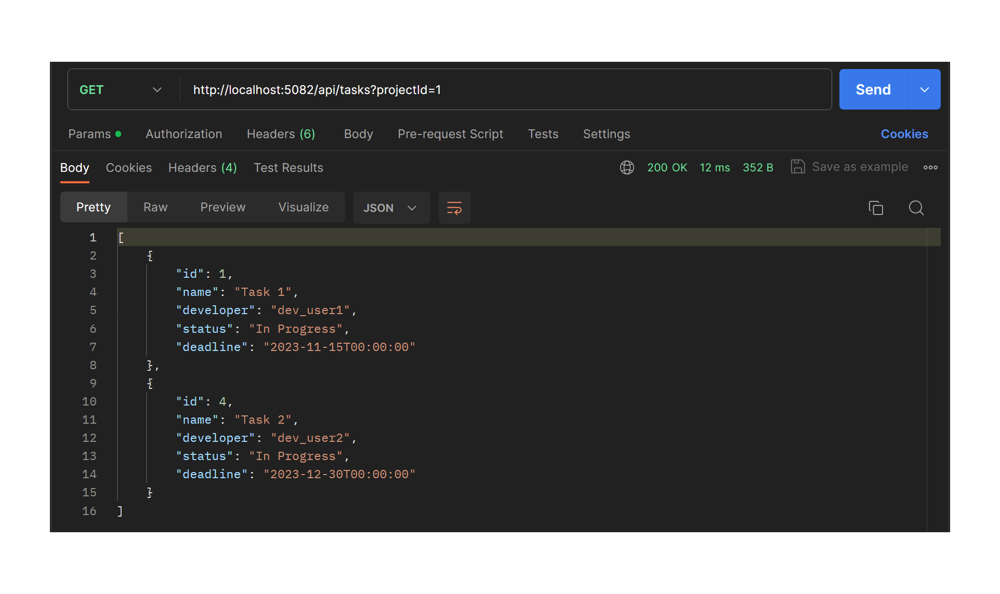

# Тестування працездатності системи за допомогою Postman

## GET /api/projects

## POST /api/projects

## GET /api/projects/:projectId

## PATCH /projects/:projectId

## DELETE /projects/projectId

## GET /api/projects/:projectId/reviews

## POST /api/projects/:projectId/reviews

## GET /api/tasks

## POST /api/tasks

## GET /api/tasks/:taskId

## PATCH /api/tasks/:taskId

## DELETE /api/tasks/:taskId

## GET /api/users

## GET /api/users/:taskId

## PATCH /api/users/:userId

## DELETE /api/users/:userId

## POST /api/users/:userId/projects/:projectId

